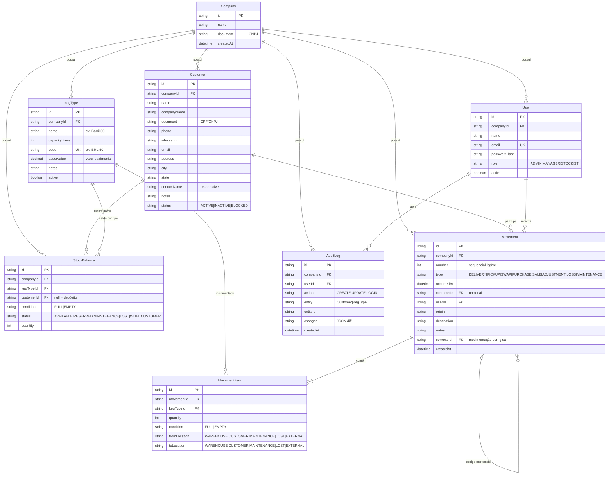

# KegControl — Modelo de Dados

> Dev: SQLite · Produção: PostgreSQL (mesmo schema Prisma, troca de provider).
> Como o SQLite não suporta enums nativos, os campos de enum são `String`
> validados por Zod na aplicação; na migração para PostgreSQL podem virar enums nativos.

## Diagrama Entidade-Relacionamento

## Relacionamentos e regras

**Company → tudo.** Toda tabela carrega `companyId` (preparação SaaS). O MVP roda
com uma única empresa criada no seed; os serviços já filtram por `companyId`.

**StockBalance — o saldo por bucket.** Cada linha responde: *quantos barris do
tipo X, na condição Y (cheio/vazio), com status Z, estão no local W?*
- `customerId = null` → barris no depósito da distribuidora.
- `customerId` preenchido → barris em poder daquele cliente (status `WITH_CUSTOMER`).
- Constraint única `(companyId, kegTypeId, customerId, condition, status)` impede
  buckets duplicados; upsert atômico dentro da transação da movimentação.
- **Total do patrimônio** = Σ quantity de todos os buckets ≠ `LOST` (perdidos são
  rastreados à parte). **Saldo de um cliente** = Σ dos buckets daquele cliente.

**Movement + MovementItem — partida dobrada.** Cada item transfere `quantity`
barris de `fromLocation` para `toLocation`. A transação: (1) valida saldo na
origem, (2) decrementa origem, (3) incrementa destino, (4) grava o movimento,
(5) grava auditoria. Se qualquer passo falhar, nada é persistido.
- `EXTERNAL` não é bucket: compra cria patrimônio, venda remove — mas o registro
  do movimento preserva o histórico.
- **Imutável**: sem UPDATE/DELETE. Erros geram novo movimento `ADJUSTMENT` com
  `correctsId` apontando para o original — trilha de correção explícita.
- `number` é sequencial por empresa para referência humana (MOV-000123).

**Extrato do cliente** (estilo bancário): consulta os `MovementItem` cujo
`fromLocation` ou `toLocation` = `CUSTOMER` daquele cliente, ordenados por data,
computando o saldo corrente linha a linha (entregas somam, retiradas subtraem).

**AuditLog — append-only.** Alimentado pela camada de serviços em toda mutação
(inclusive login). `changes` guarda diff JSON `{campo: {de, para}}`. Sem endpoints
de escrita externa, sem exclusão.

## Índices

- `User.email` único · `KegType(companyId, code)` único
- `StockBalance(companyId, kegTypeId, customerId, condition, status)` único
- `Movement(companyId, occurredAt)` e `Movement(companyId, customerId)` para extratos
- `AuditLog(companyId, createdAt)` · `Customer(companyId, name)` para busca
